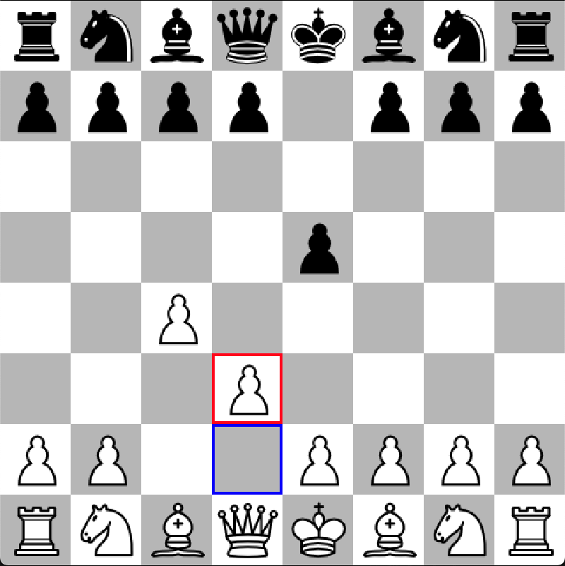

# Chess Engine

A chess engine built using an evaluation function that is a combination of a neural network trained on [this dataset](https://www.kaggle.com/datasets/arevel/chess-games) and a handcrafted evaluation function, together with an alpha-beta pruning algorithm. This engine can beat me with white pieces.




## Features

- **Board Representation**: Converts the chess board state into a 14-layered matrix, see state.py for more information.
- **Move Generation**: Identifies and encodes all legal moves available in the current board state.
- **Castling and En Passant Handling**: Tracks castling rights and en passant possibilities.
- **Check Detection**: Determines if the current player is in check.

## Installation

1. **Clone the Repository**

   ```bash
   git clone git@github.com:manos02/NN_chess_engine.git
   cd chess-engine
   ```

2. **Create a Virtual Environment**
    ```
    python3.10 -m venv venv
    source venv/bin/activate  # On Windows: venv\Scripts\activate
    ```
    
3. **Create a Virtual Environment**
    ```
    pip install -r requirements.txt
    ```

## Usage
    
    python3.10 gui.py
    

To play, click on source square (the square you want to move the piece) and then click the desired target square. For promotions type in terminal the piece you want to promote to.


